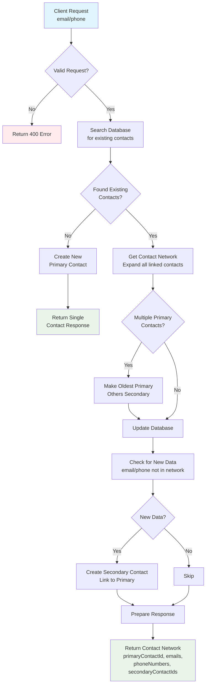

# Contact Identification Flow

A simple flow diagram showing the main contact identification and reconciliation process.

```mermaid
flowchart TD
    A[Client Request<br/>email/phone] --> B{Valid Request?}
    B -->|No| C[Return 400 Error]
    B -->|Yes| D[Search Database<br/>for existing contacts]
    
    D --> E{Found Existing<br/>Contacts?}
    E -->|No| F[Create New<br/>Primary Contact]
    F --> G[Return Single<br/>Contact Response]
    
    E -->|Yes| H[Get Contact Network<br/>Expand all linked contacts]
    H --> I{Multiple Primary<br/>Contacts?}
    I -->|Yes| J[Make Oldest Primary<br/>Others Secondary]
    J --> K[Update Database]
    I -->|No| K
    
    K --> L[Check for New Data<br/>email/phone not in network]
    L --> M{New Data?}
    M -->|Yes| N[Create Secondary Contact<br/>Link to Primary]
    M -->|No| O[Skip]
    N --> P[Prepare Response]
    O --> P
    
    P --> Q[Return Contact Network<br/>primaryContactId, emails,<br/>phoneNumbers, secondaryContactIds]
    
    style A fill:#e1f5fe
    style C fill:#ffebee
    style G fill:#e8f5e8
    style Q fill:#e8f5e8
``` 